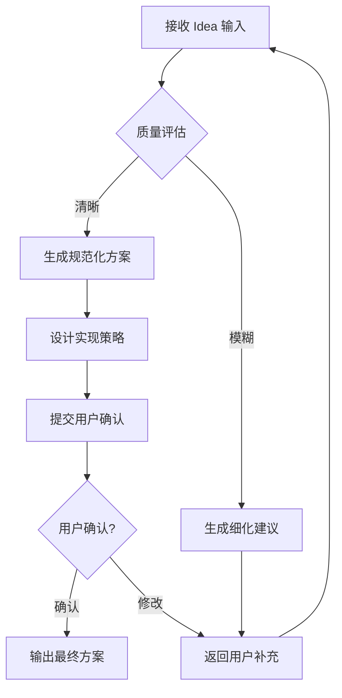
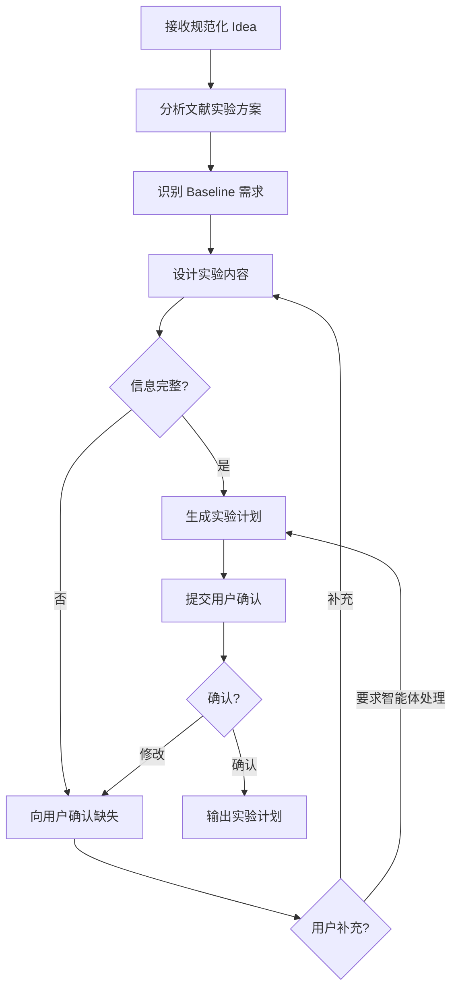
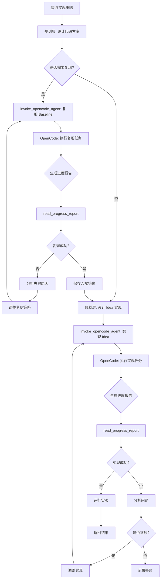
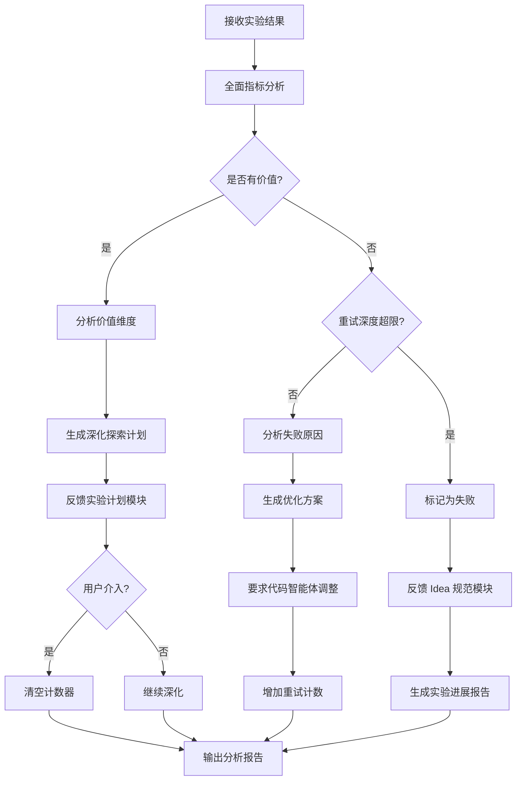
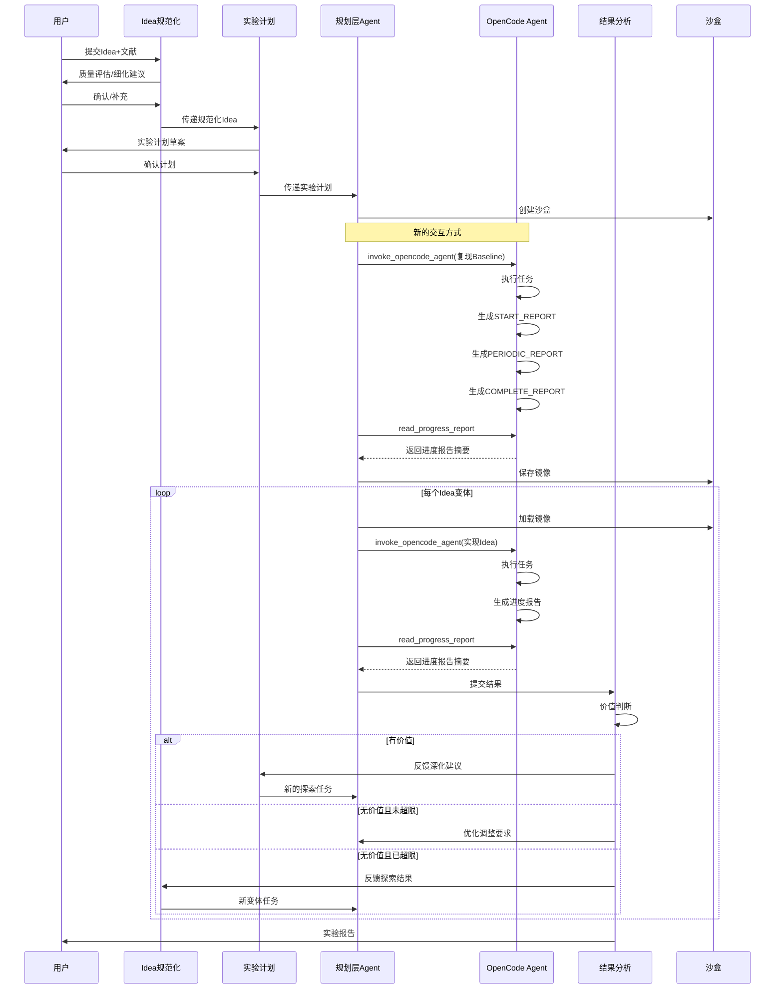

# 科研智能体系统架构设计 v4.0

## 文档信息

| 属性 | 值 |
|------|-----|
| 版本 | v4.0 |
| 日期 | 2026-02-20 |
| 状态 | 架构设计 |

---

## 1. 概述

### 1.1 设计目标

构建一个全自动化的科研智能体系统，接受人类专家的 Idea 输入，完成从文献分析、实验设计、代码实现到结果分析的完整科研流程，最终输出结构化的实验报告。

### 1.2 变更背景

现有架构 (v3.0) 中，代码智能体由规划层 (LangChain Agent) + Coding Agent (OpenCode Sub Agent) 组成，规划层通过直接调用 OpenCode 获取完整执行过程。这种方式存在以下问题：

1. **上下文膨胀**：完整的执行过程占用大量上下文窗口
2. **耦合度高**：规划层与 Coding Agent 紧密耦合
3. **缺乏约束**：OpenCode 的行为缺乏标准化约束

**v4.0 架构改进**：

1. OpenCode 直接部署到沙盒容器内，独立执行代码任务
2. 规划模块通过工具函数与 OpenCode 交互
3. OpenCode 在关键节点编写进度报告，而非返回完整执行过程
4. 通过 Skills 机制约束 OpenCode 的行为

### 1.3 核心术语定义

| 术语 | 定义 |
|------|------|
| **Idea** | 用户提出的科研创新思路，包含改进方向、预期效果等 |
| **Baseline** | 用于对比的基准方法，通常是已有 SOTA 或经典方法 |
| **沙盒镜像** | Baseline 复现完成后保存的容器镜像，包含完整的实验环境 |
| **Idea 变体** | 同一 Idea 的不同实现方式或参数配置 |
| **重试深度** | 单个 Idea 变体在效果不佳时的最大重试次数 |
| **有价值的结果** | 在任意评估指标上出现 ≥10% 提升的实验结果 |
| **评估指标体系** | 包含关键指标（acc、f1）和辅助指标（计算成本、时间等）的完整评估框架 |
| **规划层 Agent** | 负责代码工作规划的 LangChain Agent |
| **OpenCode Agent** | 部署在沙盒容器内的独立 Coding Agent，通过 Skills 约束行为 |
| **进度报告** | OpenCode 在关键节点生成的结构化报告，用于与规划层通信 |
| **Skills** | 约束 OpenCode 行为的规则和模板，定义触发条件和输出格式 |
| **错误循环** | 连续3次相同错误 或 10分钟内5次不同错误的异常状态 |

---

## 2. 架构总览

### 2.1 三层架构

```
┌─────────────────────────────────────────────────────────────────────────────┐
│                           科研智能体系统 v4.0                                  │
├─────────────────────────────────────────────────────────────────────────────┤
│  ┌─────────────────────────────────────────────────────────────────────┐   │
│  │                      第一层：交互层 (Interaction)                     │   │
│  │  ┌──────────────────────┐      ┌──────────────────────┐            │   │
│  │  │   Idea 规范化模块    │      │    实验计划模块      │            │   │
│  │  │  (LangChain Agent)   │      │  (LangChain Agent)   │            │   │
│  │  └──────────┬───────────┘      └──────────┬───────────┘            │   │
│  └─────────────┼──────────────────────────────┼────────────────────────┘   │
│                ▼                              ▼                            │
│  ┌─────────────────────────────────────────────────────────────────────┐   │
│  │                      第二层：执行层 (Execution)                       │   │
│  │  ┌───────────────────────────────────────────────────────────────┐ │   │
│  │  │              规划层 Agent (LangChain Agent)                    │ │   │
│  │  │  • 任务规划与分解    • 状态管理    • 长程规划                  │ │   │
│  │  │  • 工具函数: invoke_opencode_agent, read_progress_report      │ │   │
│  │  └───────────────────────────┬───────────────────────────────────┘ │   │
│  │                              │ 工具调用                             │   │
│  │                              ▼                                      │   │
│  │  ┌───────────────────────────────────────────────────────────────┐ │   │
│  │  │            沙盒容器层 (Sandbox Container)                       │ │   │
│  │  │  ┌─────────────────────────────────────────────────────────┐  │ │   │
│  │  │  │            OpenCode Agent (Coding Agent)                 │  │ │   │
│  │  │  │  • Skills Engine (SKILL.md)                             │  │ │   │
│  │  │  │  • Tool Chain (Bash/Read/Write)                         │  │ │   │
│  │  │  │  • Progress Report Generator                            │  │ │   │
│  │  │  └─────────────────────────────────────────────────────────┘  │ │   │
│  │  └───────────────────────────────────────────────────────────────┘ │   │
│  └─────────────────────────────────────────────────────────────────────┘   │
│                ▼                                                            │
│  ┌─────────────────────────────────────────────────────────────────────┐   │
│  │                      第三层：分析层 (Analysis)                        │   │
│  │                 实验结果分析模块 (LangChain Agent)                   │   │
│  └─────────────────────────────────────────────────────────────────────┘   │
└─────────────────────────────────────────────────────────────────────────────┘
```

### 2.2 OpenCode 在架构中的位置

| 位置 | 说明 |
|------|------|
| **所在层级** | 第二层（执行层）的沙盒容器内 |
| **角色** | Coding Agent (独立运行) |
| **与规划层关系** | 通过工具函数被调用，通过进度报告返回结果 |
| **通信方式** | 进度报告文件 + HTTP API（状态查询） |

### 2.3 层级说明

- **第一层（交互层）**：直接与用户交互，负责需求澄清和方案确认
- **第二层（执行层）**：与第一层和第三层交互，负责代码实现
- **第三层（分析层）**：与第一层、第二层及用户交互，负责结果分析

---

## 3. 模块详细设计

### 3.1 Idea 规范化模块

#### 3.1.1 基本信息

| 属性 | 值 |
|------|-----|
| **模块名称** | IdeaNormalizationModule |
| **实现技术** | LangChain Agent |
| **所在层级** | 第一层（交互层） |

#### 3.1.2 职责

1. 解析用户输入的 Idea，理解创新点和预期目标
2. 分析相关文献，掌握领域常规方案和最新进展
3. 识别代码改进位置，确定修改范围
4. 设计 Idea 的多种落地方式（不同实现策略）
5. 输出代码智能体可执行的代码修改方案

#### 3.1.3 输入

| 输入项 | 类型 | 必填 | 说明 |
|--------|------|------|------|
| idea_description | string | 是 | Idea 的自然语言描述 |
| references | List[Reference] | 否 | 相关文献列表 |
| code_repositories | List[string] | 否 | GitHub 仓库链接 |
| code_files | List[File] | 否 | 直接上传的代码文件 |
| constraints | Constraint | 否 | 约束条件（时间、资源等） |

#### 3.1.4 输出

| 输出项 | 类型 | 说明 |
|--------|------|------|
| idea_quality_report | Report | Idea 质量评估报告 |
| normalized_idea | NormalizedIdea | 规范化后的 Idea 结构 |
| implementation_strategies | List[Strategy] | 多种落地策略 |
| user_confirmation | Confirmation | 用户确认结果 |

**输出状态：**
- 若 Idea 足够清晰：输出规范化方案，提交用户确认
- 若 Idea 较模糊：输出细化建议，要求用户补充

#### 3.1.5 工作流程



---

### 3.2 实验计划模块

#### 3.2.1 基本信息

| 属性 | 值 |
|------|-----|
| **模块名称** | ExperimentPlanningModule |
| **实现技术** | LangChain Agent |
| **所在层级** | 第一层（交互层） |

#### 3.2.2 职责

1. 分析领域常规实验方案
2. 识别所需的 Baseline 方法和数据集
3. 设计完整的实验内容
4. 确定评估指标体系

#### 3.2.3 输入

| 输入项 | 类型 | 必填 | 说明 |
|--------|------|------|------|
| normalized_idea | NormalizedIdea | 是 | 规范化后的 Idea |
| references | List[Reference] | 是 | 相关文献 |
| existing_baselines | List[Baseline] | 否 | 已有 Baseline 信息 |

#### 3.2.4 输出

| 输出项 | 类型 | 说明 |
|--------|------|------|
| experiment_plan | ExperimentPlan | 完整实验计划 |
| required_baselines | List[Baseline] | 所需 Baseline 列表 |
| datasets | List[Dataset] | 所需数据集 |
| evaluation_metrics | MetricSystem | 评估指标体系 |
| user_confirmation | Confirmation | 用户确认结果 |

#### 3.2.5 工作流程



---

### 3.3 代码智能体（更新）

#### 3.3.1 基本信息

| 属性 | 值 |
|------|-----|
| **模块名称** | CodeAgent |
| **所在层级** | 第二层（执行层） |
| **组成** | 规划层 Agent + OpenCode Agent (沙盒内) |

#### 3.3.2 分层结构

```
代码智能体
├── 规划层 Agent (Planning Layer)
│   ├── 实现: LangChain Agent
│   ├── 职责: 代码工作方案设计、任务分解
│   ├── 特点: 长程规划、状态管理、工具调用
│   └── 交互: 通过工具函数调用 OpenCode
│
└── OpenCode Agent (Sandbox 内)
    ├── 实现: OpenCode CLI + Bun Runtime
    ├── 职责: 具体代码编写、调试、执行
    ├── 特点: 强大的 Coding 能力、Skills 约束
    └── 交互: 通过进度报告返回执行结果
```

#### 3.3.3 规划层 Agent

**职责：**
1. 将 Idea 实现方案分解为可执行的代码任务
2. 通过工具函数调用 OpenCode Agent 执行任务
3. 读取 OpenCode 的进度报告，而非完整执行过程
4. 管理长程任务状态，降低上下文窗口压力

**关键技术：**
- 使用 LangChain 的 Agent 框架
- 通过工具函数与沙盒内的 OpenCode 交互
- 进度报告摘要机制

**输入：**
| 输入项 | 类型 | 说明 |
|--------|------|------|
| implementation_strategy | Strategy | Idea 实现策略 |
| experiment_plan | ExperimentPlan | 实验计划 |
| sandbox_info | SandboxInfo | 沙盒状态信息 |

**输出：**
| 输出项 | 类型 | 说明 |
|--------|------|------|
| task_execution_summary | List[TaskSummary] | 任务执行摘要 |
| code_artifacts | CodeArtifacts | 代码产出物 |
| experiment_results | List[ExperimentResult] | 实验结果 |

#### 3.3.4 OpenCode Agent (沙盒内)

**职责：**
1. 在沙盒内完成具体代码编写
2. 执行代码调试和测试
3. 运行实验并收集结果
4. 在关键节点生成进度报告

**关键技术：**
- 基于 OpenCode CLI 实现，运行在沙盒容器内
- 通过 Skills 机制约束行为
- 支持 Bash、文件操作、代码编辑等工具
- 进度报告生成器

**与规划层交互：**
```
规划层 Agent
    │
    │ 工具调用: invoke_opencode_agent(task, skills)
    ▼
OpenCode Agent (沙盒内)
    │
    │ 执行代码任务
    │ Skills 约束行为
    │ 关键节点生成进度报告
    ▼
规划层读取进度报告
    │
    │ read_progress_report(task_id)
    ▼
获取执行摘要，继续规划
```

#### 3.3.5 工作流程



#### 3.3.6 沙盒镜像管理策略

**保存时机：**
- 所有 Baseline 完成复现
- 在文献使用的数据集上达到文献性能水平
- 实验框架搭建完成

**保存粒度：**
- 以 **Baseline** 为单位保存镜像
- 实验中涉及的全部 Baseline 复现工作对应一个沙盒镜像

**使用方式：**
- 以 **Idea 优化方向** 为单位使用镜像
- 从 Baseline 镜像创建新沙盒
- 在沙盒内执行 Idea 优化

---

### 3.4 实验结果分析模块

#### 3.4.1 基本信息

| 属性 | 值 |
|------|-----|
| **模块名称** | ResultAnalysisModule |
| **实现技术** | LangChain Agent |
| **所在层级** | 第三层（分析层） |

#### 3.4.2 职责

1. 分析单个 Idea 变体的实验结果
2. 判断结果是否"有价值"
3. 对效果差的结果提出优化方案
4. 对有价值的结果提出深化探索建议
5. 生成实验进展和探索报告

#### 3.4.3 评估指标体系

**默认指标体系：**

| 类别 | 指标 | 说明 |
|------|------|------|
| **关键指标** | accuracy | 准确率 |
| | f1_score | F1 分数 |
| | precision | 精确率 |
| | recall | 召回率 |
| **效率指标** | inference_time | 推理时间 |
| | training_time | 训练时间 |
| | memory_usage | 内存占用 |
| | compute_cost | 计算成本 |
| **稳定性指标** | convergence_speed | 收敛速度 |
| | stability | 结果稳定性 |

**用户自定义：**
- 用户可通过配置文件扩展指标体系
- 支持自定义指标计算公式

**"有价值"判定标准：**
- 在任意指标上出现 ≥10% 的提升
- 或在多个指标上出现 ≥5% 的综合提升

**有条件使用：**
- 根据实验内容，避免使用无法测量的指标

#### 3.4.4 输入

| 输入项 | 类型 | 说明 |
|--------|------|------|
| experiment_result | ExperimentResult | 实验结果 |
| idea_strategy | Strategy | Idea 落地策略 |
| experiment_plan | ExperimentPlan | 实验计划 |
| reference_insights | Insights | 文献调研内容 |

#### 3.4.5 输出

| 输出项 | 类型 | 说明 |
|--------|------|------|
| analysis_report | AnalysisReport | 分析报告 |
| value_assessment | ValueAssessment | 价值评估 |
| optimization_plan | OptimizationPlan | 优化方案（效果差时）|
| deep_exploration_plan | ExplorationPlan | 深化探索计划（有价值时）|
| retry_count | int | 当前重试次数 |

#### 3.4.6 重试深度机制

**定义：** 针对单个 Idea 变体的最大重试次数

**配置：**
```json
{
  "retry_depth": {
    "max_attempts": 3,
    "current_attempt": 0,
    "reset_triggers": ["user_new_info", "strategy_change"]
  }
}
```

**重试策略：**
1. **效果差时的处理：**
   - 若重试次数 < max_attempts：生成优化方案，直接要求代码智能体调整
   - 若重试次数 >= max_attempts：标记为失败，将分析结果提交给 Idea 规范化模块指导后续探索

2. **有价值时的处理：**
   - 生成深化探索计划
   - 反馈给实验计划模块设计深入实验
   - 不清空重试计数器（因为是深化而非重试）

#### 3.4.7 工作流程



---

## 4. OpenCode 沙盒部署方案

### 4.1 沙盒容器架构

```
沙盒容器 (Docker Container)
├── OpenCode Agent
│   ├── opencode CLI + Bun Runtime
│   ├── Research Skills (.opencode/)
│   └── /workspace (挂载卷)
│       ├── src/          # 代码目录
│       ├── data/         # 数据目录
│       ├── output/       # 输出目录
│       ├── logs/         # 日志目录
│       └── .progress/    # 进度报告目录
├── 环境配置 (Python 3.11+, Node.js 24/Bun, PyTorch)
└── 网络配置 (API Endpoint, 白名单域名)
```

### 4.2 OpenCode 沙盒配置

```python
from pydantic import BaseModel
from typing import List, Optional

class OpenCodeSandboxConfig(BaseModel):
    """OpenCode 沙盒配置"""
    # 基础配置
    name: str
    image: str = "opencode-research:latest"

    # 资源配置
    cpus: float = 4.0
    memory: str = "16g"
    gpus: int = 0

    # OpenCode 特有配置
    opencode_model: str = "claude-3-5-sonnet-20241022"
    opencode_agent: str = "build"  # build, plan
    opencode_skills: List[str] = []  # 要加载的 skill 名称

    # 进度报告配置
    progress_report_dir: str = "/workspace/.progress"
    report_interval: int = 1800  # 定期报告间隔（秒）

    # 超时配置
    task_timeout: int = 7200  # 任务超时（秒）
    error_loop_threshold: int = 3  # 连续错误阈值
    error_window: int = 600  # 错误窗口（秒）

    # 网络配置
    network_enabled: bool = True
    allowed_domains: List[str] = ["github.com", "huggingface.co", "arxiv.org"]
```

### 4.3 沙盒生命周期

```python
class OpenCodeSandboxManager:
    """OpenCode 沙盒管理器"""

    def create_opencode_sandbox(
        self,
        config: OpenCodeSandboxConfig
    ) -> SandboxInstance:
        """创建带 OpenCode 的沙盒"""
        # 1. 创建 Docker 容器
        # 2. 安装 OpenCode CLI
        # 3. 配置 Skills
        # 4. 初始化进度报告目录
        pass

    def invoke_opencode(
        self,
        sandbox_id: str,
        task: str,
        skills: List[str] = None,
        timeout: int = None
    ) -> str:
        """调用 OpenCode 执行任务"""
        # 返回任务 ID
        pass

    def read_progress_report(
        self,
        sandbox_id: str,
        report_type: str = "latest"
    ) -> ProgressReport:
        """读取进度报告"""
        pass

    def query_task_status(
        self,
        sandbox_id: str,
        task_id: str
    ) -> TaskStatus:
        """查询任务状态"""
        pass

    def abort_task(
        self,
        sandbox_id: str,
        task_id: str,
        reason: str
    ) -> AbortResult:
        """中止任务"""
        pass
```

---

## 5. Skills 设计

### 5.1 科研场景 Skills 目录结构

```
.opencode/skill/
├── research-experiment/        # 实验执行 skill
│   └── SKILL.md
├── baseline-reproduction/      # Baseline 复现 skill
│   └── SKILL.md
├── idea-implementation/        # Idea 实现 skill
│   └── SKILL.md
├── error-recovery/             # 错误恢复 skill
│   └── SKILL.md
└── progress-report/            # 进度报告 skill (核心)
    └── SKILL.md
```

### 5.2 核心 Skill: progress-report

#### 5.2.1 触发条件

| 节点类型 | 触发条件 | 报告内容 |
|---------|---------|---------|
| **任务开始** | 接收到新任务 | 任务描述、预期目标 |
| **任务完成** | 任务执行成功 | 执行结果、关键指标 |
| **任务失败** | 遇到不可恢复错误 | 错误详情、尝试的解决方案 |
| **任务中止** | 外部中断或超时 | 中止原因、已完成部分 |
| **错误循环** | 连续3次相同错误 或 10分钟内5次错误 | 错误分析、需要干预 |
| **定期报告** | 每30分钟 | 当前进度、资源使用 |
| **里程碑** | 进度达25%/50%/75% | 阶段性成果 |

#### 5.2.2 进度报告格式

```markdown
# 进度报告

**文档类型**: PROGRESS
**任务ID**: {task_id}
**生成时间**: {timestamp}
**状态**: RUNNING|COMPLETED|FAILED|ABORTED|ERROR_LOOP
**进度**: {current}/{total} ({percentage}%)

---

## 执行摘要
{200字以内的摘要}

## 关键指标
| 指标名 | 值 | 目标 | 状态 |
|--------|-----|------|------|

## 问题与解决方案
{遇到的问题和采取的解决方案}

## 下一步
{下一步计划}

---
**Agent签名**: OpenCode-Agent-{version}
```

#### 5.2.3 Skill 定义示例

```markdown
# Progress Report Skill

## 触发规则

1. **任务开始时**：生成 START_REPORT
2. **任务完成时**：生成 COMPLETE_REPORT
3. **任务失败时**：生成 FAILED_REPORT
4. **检测到错误循环时**：生成 ERROR_LOOP_REPORT
5. **每30分钟**：生成 PERIODIC_REPORT
6. **进度里程碑时**：生成 MILESTONE_REPORT

## 错误循环检测

```python
ERROR_WINDOW = 600  # 10分钟窗口
MAX_CONSECUTIVE_ERRORS = 3  # 连续相同错误阈值
MAX_ERRORS_IN_WINDOW = 5    # 窗口内错误阈值
```

## 报告生成要求

1. 摘要不超过200字
2. 关键指标使用表格展示
3. 问题与解决方案清晰列出
4. 下一步计划具体可行

## 存储位置

所有报告存储在 `/workspace/.progress/` 目录
```

### 5.3 其他 Skills 概述

#### 5.3.1 research-experiment Skill

**用途**：执行科研实验的标准流程

**关键行为**：
- 遵循实验计划的步骤
- 记录所有实验配置
- 生成可复现的结果

#### 5.3.2 baseline-reproduction Skill

**用途**：复现 Baseline 方法

**关键行为**：
- 严格按照文献配置复现
- 验证复现结果是否达标
- 生成复现报告

#### 5.3.3 idea-implementation Skill

**用途**：实现 Idea 变体

**关键行为**：
- 按照实现策略编写代码
- 确保代码质量
- 生成实现文档

#### 5.3.4 error-recovery Skill

**用途**：错误恢复和问题解决

**关键行为**：
- 分析错误原因
- 尝试多种解决方案
- 记录恢复过程

---

## 6. 工具函数设计

### 6.1 OpenCode 交互工具

| 工具函数 | 功能 | 返回值 |
|---------|------|--------|
| `invoke_opencode_agent` | 启动 OpenCode 执行任务 | 任务 ID 和初始状态 |
| `read_progress_report` | 读取进度报告 | 报告内容 |
| `query_task_status` | 查询任务状态 | 运行状态、资源使用 |
| `abort_opencode_task` | 中止任务 | 操作结果 |

### 6.2 工具函数详细定义

#### 6.2.1 invoke_opencode_agent

**功能**：启动 OpenCode Agent 执行任务

**调用者**：规划层 Agent

**参数**：

| 参数 | 类型 | 必填 | 说明 |
|------|------|------|------|
| `sandbox_id` | string | 是 | 沙盒 ID |
| `task_description` | string | 是 | 任务描述 |
| `skills` | List[string] | 否 | 要加载的 Skills |
| `timeout` | int | 否 | 超时时间（秒），默认 7200 |
| `context` | object | 否 | 上下文信息 |

**返回值**：

```json
{
  "task_id": "task_001",
  "status": "started",
  "sandbox_id": "sb_001",
  "skills_loaded": ["progress-report", "baseline-reproduction"],
  "estimated_duration": 3600
}
```

**示例**：

```python
result = invoke_opencode_agent(
    sandbox_id="sb_001",
    task_description="复现 Standard Transformer 在 WMT14 上的训练",
    skills=["progress-report", "baseline-reproduction"],
    timeout=7200,
    context={
        "target_bleu": 27.3,
        "dataset": "WMT14-En-De"
    }
)
```

---

#### 6.2.2 read_progress_report

**功能**：读取进度报告

**调用者**：规划层 Agent

**参数**：

| 参数 | 类型 | 必填 | 说明 |
|------|------|------|------|
| `sandbox_id` | string | 是 | 沙盒 ID |
| `task_id` | string | 是 | 任务 ID |
| `report_type` | string | 否 | 报告类型：latest/all/type |

**返回值**：

```json
{
  "task_id": "task_001",
  "reports": [
    {
      "type": "START_REPORT",
      "timestamp": "2024-02-19T14:00:00Z",
      "status": "RUNNING",
      "progress": "0/100 (0%)",
      "summary": "开始复现 Standard Transformer..."
    },
    {
      "type": "PERIODIC_REPORT",
      "timestamp": "2024-02-19T14:30:00Z",
      "status": "RUNNING",
      "progress": "30/100 (30%)",
      "summary": "数据预处理完成，开始训练..."
    }
  ]
}
```

---

#### 6.2.3 query_task_status

**功能**：查询任务状态

**调用者**：规划层 Agent

**参数**：

| 参数 | 类型 | 必填 | 说明 |
|------|------|------|------|
| `sandbox_id` | string | 是 | 沙盒 ID |
| `task_id` | string | 是 | 任务 ID |

**返回值**：

```json
{
  "task_id": "task_001",
  "status": "RUNNING|COMPLETED|FAILED|ABORTED|ERROR_LOOP",
  "progress": {
    "current": 30,
    "total": 100,
    "percentage": 30
  },
  "resources": {
    "cpu_usage": 85.5,
    "memory_usage_mb": 8192,
    "gpu_usage": 92.0
  },
  "errors_count": 0,
  "last_report_time": "2024-02-19T14:30:00Z"
}
```

---

#### 6.2.4 abort_opencode_task

**功能**：中止任务

**调用者**：规划层 Agent

**参数**：

| 参数 | 类型 | 必填 | 说明 |
|------|------|------|------|
| `sandbox_id` | string | 是 | 沙盒 ID |
| `task_id` | string | 是 | 任务 ID |
| `reason` | string | 是 | 中止原因 |

**返回值**：

```json
{
  "task_id": "task_001",
  "status": "ABORTED",
  "abort_time": "2024-02-19T14:45:00Z",
  "reason": "用户请求中止",
  "completed_work": "数据预处理完成，训练进度30%"
}
```

---

### 6.3 沙盒管理工具（继承自 v3）

沙盒管理工具与 v3 版本保持一致，包括：
- `sandbox_create`
- `sandbox_load_from_image`
- `sandbox_save_as_image`
- `sandbox_destroy`
- `sandbox_list`
- `sandbox_execute`
- `sandbox_copy_to`
- `sandbox_copy_from`
- `sandbox_checkpoint`
- `sandbox_rollback`
- `sandbox_get_metrics`

详细定义见 [tool-functions.md](./tool-functions.md)。

---

## 7. 进度报告机制

### 7.1 报告生命周期

```
任务开始
    │
    ▼
START_REPORT ─────────────────────────────┐
    │                                      │
    ▼                                      │
执行任务                                    │
    │                                      │
    ├── 定期 ──▶ PERIODIC_REPORT           │
    │                                      │
    ├── 里程碑 ──▶ MILESTONE_REPORT        │  存储在
    │                                      │  /workspace/.progress/
    ├── 错误 ──▶ ERROR_REPORT              │
    │       │                              │
    │       └── 错误循环 ──▶ ERROR_LOOP_REPORT
    │                                      │
    ▼                                      │
任务结束                                    │
    │                                      │
    ├── 成功 ──▶ COMPLETE_REPORT ──────────┤
    │                                      │
    ├── 失败 ──▶ FAILED_REPORT ────────────┤
    │                                      │
    └── 中止 ──▶ ABORT_REPORT ─────────────┘
```

### 7.2 报告存储结构

```
/workspace/.progress/
├── task_001/
│   ├── START_REPORT.md
│   ├── PERIODIC_REPORT_001.md
│   ├── PERIODIC_REPORT_002.md
│   ├── MILESTONE_REPORT_25.md
│   ├── MILESTONE_REPORT_50.md
│   ├── COMPLETE_REPORT.md
│   └── index.json
├── task_002/
│   └── ...
└── latest.json
```

### 7.3 报告索引文件

**index.json**

```json
{
  "task_id": "task_001",
  "status": "COMPLETED",
  "start_time": "2024-02-19T14:00:00Z",
  "end_time": "2024-02-19T16:00:00Z",
  "total_reports": 6,
  "reports": [
    {"type": "START", "path": "START_REPORT.md", "timestamp": "..."},
    {"type": "PERIODIC", "path": "PERIODIC_REPORT_001.md", "timestamp": "..."},
    {"type": "MILESTONE", "path": "MILESTONE_REPORT_25.md", "timestamp": "..."},
    {"type": "MILESTONE", "path": "MILESTONE_REPORT_50.md", "timestamp": "..."},
    {"type": "PERIODIC", "path": "PERIODIC_REPORT_002.md", "timestamp": "..."},
    {"type": "COMPLETE", "path": "COMPLETE_REPORT.md", "timestamp": "..."}
  ]
}
```

---

## 8. 关键节点检测机制

### 8.1 错误循环检测

```python
class ProgressMonitor:
    """进度监控器"""

    ERROR_WINDOW = 600  # 10分钟窗口
    MAX_CONSECUTIVE_ERRORS = 3  # 连续相同错误阈值
    MAX_ERRORS_IN_WINDOW = 5    # 窗口内错误阈值

    def __init__(self):
        self.error_history = []
        self.last_error_message = None
        self.consecutive_error_count = 0

    def check_error_loop(self, error_message: str) -> bool:
        """检测是否进入错误循环"""
        current_time = time.time()

        # 清理过期错误记录
        self.error_history = [
            t for t in self.error_history
            if current_time - t < self.ERROR_WINDOW
        ]

        # 检测连续相同错误
        if error_message == self.last_error_message:
            self.consecutive_error_count += 1
            if self.consecutive_error_count >= self.MAX_CONSECUTIVE_ERRORS:
                return True
        else:
            self.consecutive_error_count = 1
            self.last_error_message = error_message

        # 记录新错误
        self.error_history.append(current_time)

        # 检测窗口内错误数量
        if len(self.error_history) >= self.MAX_ERRORS_IN_WINDOW:
            return True

        return False
```

### 8.2 报告触发逻辑

```python
def detect_key_node(
    self,
    event_type: str,
    context: Dict
) -> Optional[str]:
    """检测关键节点，返回需要生成的报告类型"""

    if event_type == "task_start":
        return "START_REPORT"

    elif event_type == "task_complete":
        return "COMPLETE_REPORT"

    elif event_type == "error":
        if self.check_error_loop(context["error"]):
            return "ERROR_LOOP_REPORT"  # 需要人工干预
        return "ERROR_REPORT"

    elif event_type == "abort":
        return "ABORT_REPORT"

    elif event_type == "periodic":
        if self.should_report():  # 检查是否到达报告间隔
            return "PERIODIC_REPORT"

    elif event_type == "progress":
        percentage = context.get("percentage", 0)
        if percentage in [25, 50, 75]:
            return "MILESTONE_REPORT"

    return None
```

### 8.3 进度估算

```python
class ProgressEstimator:
    """进度估算器"""

    def __init__(self, total_steps: int):
        self.total_steps = total_steps
        self.completed_steps = 0
        self.step_weights = {}

    def update_progress(self, step: str, weight: float = 1.0):
        """更新进度"""
        if step not in self.step_weights:
            self.step_weights[step] = weight
            self.completed_steps += weight

    def get_percentage(self) -> int:
        """获取进度百分比"""
        if self.total_steps == 0:
            return 0
        return int((self.completed_steps / self.total_steps) * 100)
```

---

## 9. 跨模块交互设计

### 9.1 交互关系矩阵

| 模块 | Idea 规范化 | 实验计划 | 规划层 Agent | OpenCode Agent | 结果分析 | 用户 |
|------|------------|----------|-------------|----------------|----------|------|
| **Idea 规范化** | - | 协作 | - | - | 接收反馈 | 确认/补充 |
| **实验计划** | 协作 | - | 提供计划 | - | 接收反馈 | 确认/补充 |
| **规划层 Agent** | 接收策略 | 接收计划 | - | 调用/读取报告 | 提供结果 | - |
| **OpenCode Agent** | - | - | 被调用 | - | - | - |
| **结果分析** | 反馈结果 | 反馈建议 | 要求调整 | - | - | 报告/介入 |

### 9.2 核心流程时序图



### 9.3 规划层与 OpenCode 的交互流程

```
规划层 Agent                    沙盒容器 (OpenCode Agent)
     │                              │
     │ invoke_opencode_agent()     │
     │─────────────────────────────▶│
     │                              │ OpenCode 开始执行
     │                              │ Skills 约束行为
     │                              │ 生成 START_REPORT
     │                              │
     │ query_task_status()          │
     │─────────────────────────────▶│
     │◀─────────────────────────────│ 返回: RUNNING
     │                              │
     │ read_progress_report()       │
     │─────────────────────────────▶│
     │◀─────────────────────────────│ 返回进度报告
     │                              │
     │                              │ ... 执行中 ...
     │                              │ 生成 PROGRESS_REPORT (关键节点)
     │                              │
     │ read_progress_report()       │
     │─────────────────────────────▶│
     │◀─────────────────────────────│ 返回进度报告
     │                              │
     │                              │ 任务完成
     │                              │ 生成 COMPLETE_REPORT
     │                              │
     │ read_progress_report()       │
     │─────────────────────────────▶│
     │◀─────────────────────────────│ 返回: COMPLETED
     │                              │
```

---

## 10. 关键机制

### 10.1 检查点与恢复机制

**检查点类型：**
1. **Baseline 检查点**：Baseline 复现完成后的镜像
2. **实验检查点**：实验运行中的中间状态
3. **进度检查点**：OpenCode 任务的进度报告

**恢复策略：**
- 从 Baseline 检查点快速启动新实验
- 从实验检查点恢复失败的实验
- 从进度报告恢复 OpenCode 任务

### 10.2 并行探索策略

**Baseline 级别并行：**
- 同时复现多个 Baseline
- 每个 Baseline 独立保存镜像
- 每个 Baseline 沙盒内独立 OpenCode Agent

**Idea 变体级别并行：**
- 从同一 Baseline 镜像创建多个沙盒
- 并行尝试不同 Idea 实现
- 每个 OpenCode Agent 独立生成进度报告

### 10.3 人机交互触发点

| 触发条件 | 交互方式 | 说明 |
|----------|----------|------|
| Idea 质量不明确 | 要求用户补充 | 规范化阶段 |
| 实验信息缺失 | 要求用户确认 | 计划阶段 |
| 结果分析完成 | 提交报告 | 分析阶段 |
| 用户提供新信息 | 清空重试深度 | 任何阶段 |
| 系统无法自动处理 | 要求人工介入 | 异常情况 |
| ERROR_LOOP_REPORT | 需要人工干预 | 错误循环 |

---

## 11. 实现计划

### Phase 1: 创建设计文档 ✅ (本次任务)

**目标**: 创建新的架构设计文档

**输出文件**:
- `/home/zxc/CodeBase/Agent/research/doc/main-design-v4.md`

**内容结构**:
1. 概述与核心术语
2. 三层架构设计
3. 模块详细设计（更新代码智能体部分）
4. OpenCode 沙盒部署方案
5. Skills 设计与约束
6. 工具函数设计
7. 进度报告机制
8. 关键节点检测
9. 跨模块交互设计

### Phase 2: 基础设施实现 (后续)

**目标**: 实现 OpenCode 沙盒的基础设施

**任务**:
- [ ] 创建 OpenCode 沙盒 Dockerfile
- [ ] 扩展 SandboxManager 支持 OpenCode 配置
- [ ] 实现基础的 OpenCode 工具函数
- [ ] 实现进度报告读取接口

**输出文件**:
- `sandbox/Dockerfile.opencode`
- `sandbox/opencode_manager.py`
- `tools/opencode_tools.py`

### Phase 3: Skills 开发 (后续)

**目标**: 开发科研场景所需的 Skills

**任务**:
- [ ] 开发 progress-report skill
- [ ] 开发 research-experiment skill
- [ ] 开发 baseline-reproduction skill
- [ ] 开发 error-recovery skill
- [ ] 开发 idea-implementation skill

**输出文件**:
- `.opencode/skill/*/SKILL.md`

### Phase 4: 集成测试 (后续)

**目标**: 验证整体架构的正确性

**任务**:
- [ ] 端到端工作流测试
- [ ] 错误恢复测试
- [ ] 并行实验测试
- [ ] 进度报告机制测试

---

## 12. 附录

### 12.1 相关文档

| 文档 | 路径 | 说明 |
|------|------|------|
| 通信协议规范 | ./communication-protocol-v2.md | 模块间通信协议 |
| 工具函数清单 | ./tool-functions.md | 可用工具函数 |
| 状态管理设计 | ./state-management.md | 状态和调试管理 |
| v3 架构设计 | ./main-design-v3.md | 上一版架构设计 |

### 12.2 版本历史

| 版本 | 日期 | 修改内容 |
|------|------|----------|
| v1.0 | - | 初始设计 |
| v2.0 | - | 增加层级划分 |
| v3.0 | 2024-02-19 | 规范化设计，明确关键机制 |
| v4.0 | 2026-02-20 | OpenCode 沙盒部署方案，Skills 机制，进度报告通信 |

### 12.3 与 v3 的主要差异

| 方面 | v3 | v4 |
|------|-----|-----|
| Coding Agent 位置 | 规划层内部（Sub Agent） | 沙盒容器内（独立） |
| 通信方式 | 直接返回执行过程 | 进度报告文件 |
| 行为约束 | 无 | Skills 机制 |
| 上下文压力 | 高（完整执行过程） | 低（摘要报告） |
| 错误检测 | 手动 | 自动检测错误循环 |
