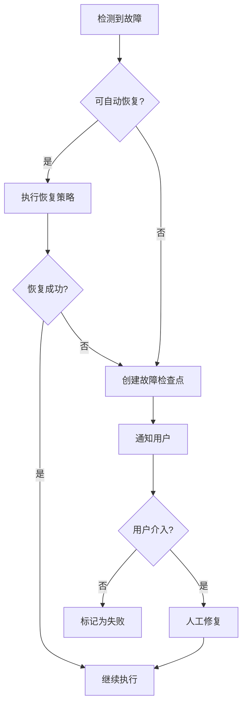

# 科研智能体系统 - 状态管理与调试

## 1. 概述

### 1.1 设计目标

- **状态持久化**：系统各阶段状态可保存和恢复
- **可追溯性**：完整记录系统执行历史
- **可调试性**：支持断点检查、状态回放
- **容错性**：故障后可从最近检查点恢复

### 1.2 状态类型

| 状态类型 | 说明 | 存储位置 |
|---------|------|----------|
| **会话状态** | 用户会话的全局信息 | `sessions/{session_id}/state.json` |
| **模块状态** | 各模块内部状态 | `sessions/{session_id}/{module}_state.json` |
| **消息状态** | 模块间通信消息 | `sessions/{session_id}/messages/` |
| **实验状态** | 实验执行状态 | `experiments/{exp_id}/state.json` |
| **沙盒状态** | 沙盒容器状态 | `sandboxes/{sb_id}/state.json` |

---

## 2. 状态文件结构

### 2.1 目录组织

```
./research_data/
├── sessions/
│   ├── session_20240219_001/
│   │   ├── session.json              # 会话元数据
│   │   ├── state.json                # 全局状态
│   │   ├── idea_normalization/       # 模块目录
│   │   │   ├── state.json            # 模块状态
│   │   │   ├── checkpoints/          # 检查点
│   │   │   └── logs/                 # 日志
│   │   ├── experiment_planning/
│   │   │   ├── state.json
│   │   │   └── checkpoints/
│   │   ├── code_agent/
│   │   │   ├── state.json
│   │   │   ├── task_records/         # 任务记录
│   │   │   └── checkpoints/
│   │   ├── result_analysis/
│   │   │   ├── state.json
│   │   │   └── checkpoints/
│   │   └── messages/                 # 通信消息
│   │       ├── msg_001.json
│   │       ├── msg_002.json
│   │       └── index.json            # 消息索引
│   └── session_20240219_002/
├── experiments/
│   ├── exp_001/
│   │   ├── experiment.json           # 实验元数据
│   │   ├── state.json                # 实验状态
│   │   ├── results/                  # 实验结果
│   │   └── logs/                     # 实验日志
│   └── exp_002/
├── sandboxes/
│   ├── sb_001/
│   │   ├── sandbox.json              # 沙盒元数据
│   │   ├── state.json                # 沙盒状态
│   │   ├── checkpoints/              # 沙盒检查点
│   │   └── metrics/                  # 资源使用指标
│   └── sb_002/
└── images/                           # 沙盒镜像
    ├── baseline_transformer_v1.tar
    └── baseline_bert_v1.tar
```

### 2.2 会话状态文件

**session.json**

```json
{
  "session_id": "session_20240219_001",
  "created_at": "2024-02-19T10:00:00Z",
  "updated_at": "2024-02-19T15:30:00Z",
  "status": "active|completed|error|paused",
  "user_id": "user_001",
  "current_phase": "code_execution",
  "idea_id": "idea_001",
  "experiment_plan_id": "plan_001",
  "participants": [
    "user",
    "idea_normalization",
    "experiment_planning",
    "code_agent",
    "result_analysis"
  ],
  "checkpoint_count": 5,
  "message_count": 25,
  "experiment_count": 3,
  "tags": ["transformer", "attention"],
  "metadata": {
    "research_domain": "nlp",
    "expected_duration": "24h"
  }
}
```

**state.json（全局状态）**

```json
{
  "session_id": "session_20240219_001",
  "timestamp": "2024-02-19T15:30:00Z",
  "version": 10,
  "phase": "code_execution",
  "active_modules": ["code_agent"],
  "completed_phases": ["idea_normalization", "experiment_planning"],
  "current_tasks": [
    {
      "task_id": "task_005",
      "module": "code_agent",
      "type": "idea_implementation",
      "status": "in_progress",
      "started_at": "2024-02-19T14:00:00Z",
      "estimated_completion": "2024-02-19T16:00:00Z"
    }
  ],
  "data_flow": {
    "idea": {"status": "completed", "output": "idea_001"},
    "experiment_plan": {"status": "completed", "output": "plan_001"},
    "baseline_reproduction": {"status": "completed", "output": "sb_image_001"},
    "idea_implementation": {"status": "in_progress", "output": null}
  }
}
```

### 2.3 模块状态文件

**idea_normalization/state.json**

```json
{
  "module": "idea_normalization",
  "session_id": "session_20240219_001",
  "timestamp": "2024-02-19T11:00:00Z",
  "status": "completed",
  "current_idea": {
    "idea_id": "idea_001",
    "version": 3,
    "status": "confirmed",
    "description": "动态稀疏注意力机制"
  },
  "iterations": [
    {
      "iteration": 1,
      "status": "needs_clarification",
      "questions_asked": 2,
      "timestamp": "2024-02-19T10:15:00Z"
    },
    {
      "iteration": 2,
      "status": "confirmed",
      "strategies_generated": 3,
      "timestamp": "2024-02-19T11:00:00Z"
    }
  ],
  "generated_strategies": [
    {
      "strategy_id": "strat_001",
      "name": "局部注意力策略",
      "status": "approved"
    }
  ],
  "user_confirmations": [
    {
      "confirmation_id": "conf_001",
      "type": "strategy_approval",
      "timestamp": "2024-02-19T11:00:00Z"
    }
  ]
}
```

**code_agent/state.json**

```json
{
  "module": "code_agent",
  "session_id": "session_20240219_001",
  "timestamp": "2024-02-19T15:30:00Z",
  "status": "active",
  "planning_layer": {
    "current_task": "idea_implementation",
    "task_queue": ["exp_variant_a", "exp_variant_b"],
    "completed_tasks": ["baseline_reproduction"],
    "context_summary": "已完成 baseline 复现，bleu=27.5，正在实现 idea 变体"
  },
  "active_sandboxes": ["sb_003", "sb_004"],
  "saved_images": [
    {
      "image_id": "img_001",
      "name": "baseline_transformer_v1",
      "created_at": "2024-02-19T12:00:00Z",
      "baseline_id": "bl_001"
    }
  ],
  "task_records": [
    {
      "task_id": "task_001",
      "type": "baseline_reproduction",
      "status": "completed",
      "sandbox_id": "sb_001",
      "duration": 7200,
      "result_summary": "Successfully reproduced baseline, bleu=27.5"
    }
  ]
}
```

---

## 3. 检查点机制

### 3.1 检查点类型

| 检查点类型 | 触发条件 | 包含内容 |
|-----------|---------|---------|
| **自动检查点** | 定时（每30分钟） | 模块状态 + 沙盒镜像 |
| **阶段检查点** | 阶段完成时 | 完整会话状态 |
| **手动检查点** | 用户触发 | 指定内容 |
| **故障检查点** | 异常发生时 | 故障现场 |

### 3.2 检查点文件结构

**checkpoints/cp_001.json**

```json
{
  "checkpoint_id": "cp_001",
  "type": "automatic|phase|manual|failure",
  "session_id": "session_20240219_001",
  "created_at": "2024-02-19T12:30:00Z",
  "triggered_by": "timer|completion|user|error",
  "description": "自动检查点 - baseline 复现阶段",
  "state_snapshot": {
    "global_state": "state.json 的引用",
    "module_states": {
      "idea_normalization": "idea_normalization/state.json 的引用",
      "experiment_planning": "experiment_planning/state.json 的引用",
      "code_agent": "code_agent/state.json 的引用"
    },
    "sandboxes": {
      "sb_001": {
        "image_saved": true,
        "image_id": "img_cp_001_sb_001"
      }
    }
  },
  "restore_instructions": {
    "steps": [
      "加载沙盒镜像 img_cp_001_sb_001",
      "恢复模块状态",
      "继续任务 baseline_reproduction"
    ]
  }
}
```

### 3.3 检查点管理

```python
class CheckpointManager:
    """检查点管理器"""

    def create_checkpoint(
        self,
        session_id: str,
        checkpoint_type: str,
        description: str = None
    ) -> Checkpoint:
        """创建检查点"""
        # 1. 保存所有模块状态
        # 2. 保存沙盒镜像
        # 3. 创建检查点元数据
        pass

    def restore_checkpoint(
        self,
        checkpoint_id: str,
        options: RestoreOptions = None
    ) -> Session:
        """从检查点恢复"""
        # 1. 读取检查点元数据
        # 2. 恢复沙盒镜像
        # 3. 恢复模块状态
        # 4. 继续执行
        pass

    def list_checkpoints(
        self,
        session_id: str,
        checkpoint_type: str = None
    ) -> List[Checkpoint]:
        """列出检查点"""
        pass

    def delete_checkpoint(self, checkpoint_id: str):
        """删除检查点"""
        pass
```

---

## 4. 消息记录与追踪

### 4.1 消息索引

**messages/index.json**

```json
{
  "session_id": "session_20240219_001",
  "total_messages": 25,
  "messages": [
    {
      "message_id": "msg_001",
      "type": "request",
      "source": "user",
      "target": "idea_normalization",
      "timestamp": "2024-02-19T10:00:00Z",
      "body_type": "submit_idea"
    },
    {
      "message_id": "msg_002",
      "type": "response",
      "source": "idea_normalization",
      "target": "user",
      "timestamp": "2024-02-19T10:05:00Z",
      "body_type": "clarification_request"
    }
  ],
  "chains": {
    "idea_flow": ["msg_001", "msg_002", "msg_003", "msg_004"],
    "experiment_flow": ["msg_005", "msg_006", "msg_007"]
  }
}
```

### 4.2 消息追踪

```python
class MessageTracer:
    """消息追踪器"""

    def trace_message_chain(
        self,
        session_id: str,
        correlation_id: str
    ) -> List[Message]:
        """
        追踪完整的消息链

        根据 correlation_id 找到相关的所有消息
        """
        messages = []
        current_id = correlation_id

        while current_id:
            msg = self.load_message(session_id, current_id)
            messages.append(msg)
            current_id = msg.header.get("parent_message_id")

        return list(reversed(messages))

    def trace_module_interaction(
        self,
        session_id: str,
        module_a: str,
        module_b: str,
        time_range: Tuple[datetime, datetime] = None
    ) -> List[Message]:
        """
        追踪两个模块间的所有交互
        """
        index = self.load_index(session_id)

        messages = []
        for msg_meta in index.messages:
            if (msg_meta["source"] in [module_a, module_b] and
                msg_meta["target"] in [module_a, module_b]):
                msg = self.load_message(session_id, msg_meta["message_id"])
                if time_range is None or self.in_range(msg.timestamp, time_range):
                    messages.append(msg)

        return sorted(messages, key=lambda m: m.timestamp)

    def generate_interaction_graph(
        self,
        session_id: str
    ) -> Graph:
        """
        生成模块交互图
        """
        # 用于可视化模块间的通信关系
        pass
```

---

## 5. 调试工具

### 5.1 状态检查器

```python
class StateInspector:
    """状态检查器"""

    def inspect_session(self, session_id: str) -> SessionReport:
        """检查会话状态"""
        return SessionReport(
            session_info=self.load_session(session_id),
            current_phase=self.get_current_phase(session_id),
            active_tasks=self.get_active_tasks(session_id),
            pending_confirmations=self.get_pending_confirmations(session_id),
            resource_usage=self.get_resource_usage(session_id)
        )

    def inspect_module(
        self,
        session_id: str,
        module: str
    ) -> ModuleReport:
        """检查模块状态"""
        return ModuleReport(
            module_state=self.load_module_state(session_id, module),
            recent_messages=self.get_recent_messages(session_id, module, limit=10),
            checkpoints=self.list_checkpoints(session_id, module),
            logs=self.get_logs(session_id, module, tail=100)
        )

    def inspect_experiment(
        self,
        experiment_id: str
    ) -> ExperimentReport:
        """检查实验状态"""
        return ExperimentReport(
            experiment_info=self.load_experiment(experiment_id),
            current_status=self.get_experiment_status(experiment_id),
            results=self.get_experiment_results(experiment_id),
            sandbox_state=self.get_sandbox_state(experiment_id),
            metrics=self.get_experiment_metrics(experiment_id)
        )
```

### 5.2 状态回放

```python
class StateReplayer:
    """状态回放器"""

    def replay_to_point(
        self,
        session_id: str,
        target_timestamp: datetime
    ) -> SystemState:
        """
        回放系统到指定时间点

        用于调试历史问题
        """
        # 1. 找到最近的检查点
        checkpoint = self.find_nearest_checkpoint(
            session_id,
            target_timestamp
        )

        # 2. 从检查点恢复
        state = self.restore_checkpoint(checkpoint.id)

        # 3. 重放消息直到目标时间
        messages = self.get_messages_between(
            checkpoint.timestamp,
            target_timestamp
        )

        for msg in messages:
            state = self.apply_message(state, msg)

        return state

    def replay_message_chain(
        self,
        session_id: str,
        correlation_id: str
    ) -> Iterator[SystemState]:
        """
        逐条回放消息链

        用于逐步调试
        """
        messages = self.tracer.trace_message_chain(
            session_id,
            correlation_id
        )

        state = self.load_initial_state(session_id)

        for msg in messages:
            state = self.apply_message(state, msg)
            yield state
```

### 5.3 调试命令行工具

```bash
# 查看会话状态
research-cli inspect session session_20240219_001

# 查看模块状态
research-cli inspect module session_20240219_001 code_agent

# 查看实验状态
research-cli inspect experiment exp_001

# 列出检查点
research-cli checkpoint list session_20240219_001

# 从检查点恢复
research-cli checkpoint restore cp_001

# 回放消息链
research-cli replay messages session_20240219_001 --correlation corr_001

# 生成交互图
research-cli visualize interactions session_20240219_001 --output graph.html

# 实时监控
research-cli monitor session_20240219_001 --metrics --logs
```

---

## 6. 故障恢复

### 6.1 故障检测

```python
class FaultDetector:
    """故障检测器"""

    def __init__(self):
        self.alerts = []

    def check_session_health(self, session_id: str) -> HealthStatus:
        """检查会话健康状态"""
        checks = [
            self.check_module_responsiveness(session_id),
            self.check_sandbox_health(session_id),
            self.check_resource_usage(session_id),
            self.check_message_flow(session_id)
        ]

        failed_checks = [c for c in checks if not c.passed]

        if failed_checks:
            return HealthStatus(
                status="unhealthy",
                issues=failed_checks,
                recommended_action=self.recommend_action(failed_checks)
            )

        return HealthStatus(status="healthy")

    def check_module_responsiveness(self, session_id: str) -> CheckResult:
        """检查模块响应性"""
        # 检查各模块是否在处理消息
        pass

    def check_sandbox_health(self, session_id: str) -> CheckResult:
        """检查沙盒健康"""
        # 检查容器状态
        pass

    def check_resource_usage(self, session_id: str) -> CheckResult:
        """检查资源使用"""
        # 检查 CPU、内存、磁盘
        pass

    def check_message_flow(self, session_id: str) -> CheckResult:
        """检查消息流"""
        # 检查是否有消息堆积
        pass
```

### 6.2 自动恢复策略

```python
class AutoRecovery:
    """自动恢复"""

    def attempt_recovery(self, session_id: str, fault: Fault) -> RecoveryResult:
        """尝试自动恢复"""

        recovery_strategies = {
            "module_timeout": self.recover_module_timeout,
            "sandbox_crash": self.recover_sandbox_crash,
            "resource_exhaustion": self.recover_resource_exhaustion,
            "message_deadlock": self.recover_message_deadlock
        }

        strategy = recovery_strategies.get(fault.type)

        if strategy:
            return strategy(session_id, fault)

        return RecoveryResult(
            success=False,
            reason="Unknown fault type",
            requires_manual_intervention=True
        )

    def recover_module_timeout(
        self,
        session_id: str,
        fault: Fault
    ) -> RecoveryResult:
        """恢复模块超时"""
        # 1. 重启模块
        # 2. 从检查点恢复状态
        # 3. 重新发送待处理消息
        pass

    def recover_sandbox_crash(
        self,
        session_id: str,
        fault: Fault
    ) -> RecoveryResult:
        """恢复沙盒崩溃"""
        # 1. 从镜像重新创建沙盒
        # 2. 从检查点恢复（如果有）
        # 3. 重新执行失败的任务
        pass
```

### 6.3 恢复流程



---

## 7. 监控与告警

### 7.1 监控指标

| 指标类别 | 指标名称 | 说明 |
|---------|---------|------|
| **系统指标** | session_active_count | 活跃会话数 |
| | message_queue_length | 消息队列长度 |
| | checkpoint_creation_rate | 检查点创建速率 |
| **模块指标** | module_response_time | 模块响应时间 |
| | module_error_rate | 模块错误率 |
| | module_task_queue | 模块任务队列 |
| **实验指标** | experiment_completion_rate | 实验完成率 |
| | experiment_average_duration | 实验平均时长 |
| | sandbox_resource_usage | 沙盒资源使用 |

### 7.2 告警规则

```yaml
alerts:
  - name: session_stuck
    condition: session.phase_duration > 2h
    severity: warning
    action: notify_user

  - name: sandbox_resource_high
    condition: sandbox.memory_usage > 90%
    severity: critical
    action: auto_scale

  - name: module_unresponsive
    condition: module.last_heartbeat > 5m
    severity: critical
    action: restart_module

  - name: experiment_failed
    condition: experiment.status == "failed"
    severity: warning
    action: create_checkpoint
```

---

## 8. 最佳实践

### 8.1 状态管理建议

1. **频繁检查点**：关键阶段后创建检查点
2. **状态验证**：定期验证状态一致性
3. **及时清理**：删除过期检查点和日志
4. **监控告警**：设置关键指标告警

### 8.2 调试技巧

1. **使用 correlation_id**：追踪完整请求链路
2. **日志分级**：合理设置日志级别
3. **状态快照**：问题发生时保存现场
4. **增量回放**：从最近检查点开始回放

### 8.3 故障处理

1. **先检查点**：故障时先创建检查点
2. **查看日志**：分析故障原因
3. **尝试恢复**：使用自动恢复机制
4. **手动介入**：复杂故障需要人工处理
